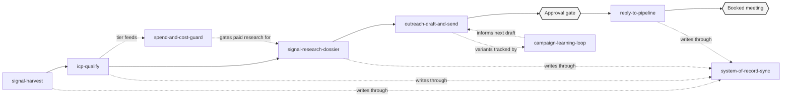

# Outbound Signal OS

**Reference/example implementation assembled to complement the Outbound system demo on my portfolio. This is not the live production Autoage source.** No real credentials, client data, pricing, or proprietary scoring internals are in this repo. Every fictional company, contact, and number below matches the fixture data used in the real demo video, for continuity between the two.

This repo exists to answer a different question than the demo video does. The video shows the system working. This repo shows how I'd actually architect it: which real, proven patterns I'd start from, how I'd assemble them into something coherent, and how I'd organize the result the way a production system actually gets organized, not as a pile of prompts.

## System map

Five pipeline stages, matched to the real Outbound system's diagram, plus three controls that run underneath the whole flow rather than living in one stage:

The flow along the top is the pipeline a lead actually moves through. The three controls underneath aren't a separate stage anyone visits, they're infrastructure every stage in the top row depends on: `system-of-record-sync` is what every skill writes through, `spend-and-cost-guard` is what gates every paid step, `campaign-learning-loop` is what compares outreach variants over time and feeds what it learns back into drafting. This mirrors the real system's diagram, where the band underneath the five visible stages holds four control boxes: these three, plus the approval-before-sends gate, which lives inside stages 4 and 5 here rather than as a skill of its own.

## The skills

| Skill | Diagram stage | What it does |
|---|---|---|
| `signal-harvest` | 1. Signals come in | Scans public sources for buying signals (hiring, funding, tech-stack change, growth, public pain), classifies each into a 5-type taxonomy with a strength rating, and batches them for qualification |
| `icp-qualify` | 2. Bad fit gets filtered | Scores every lead on a 100-point fit/signal/engagement formula, applies a missing-data cap instead of a zero, tiers TIER_1-4, and exempts leads that already cleared a real upstream qualification decision |
| `signal-research-dossier` | 3. The lead is researched | Goes beneath the first signal across four research dimensions, requires at least one corroborating data point before proceeding, and compiles a why-now angle with safe claims, avoid claims, and proof URLs |
| `outreach-draft-and-send` | 4. Outreach is staged | Drafts personalized, evidence-grounded outreach across the channels that fit the lead and holds every draft in an approval queue, nothing sends without explicit human approval |
| `reply-to-pipeline` | 5. Replies become pipeline | Classifies inbound replies against an 11-label taxonomy, suppresses every channel on a hard negative or opt-out, drafts a dossier-grounded reply, and carries a positive reply to a booked meeting |
| `system-of-record-sync` | Control: CRM stays current | Dedupes on a stable identifier, routes every field update through one reason-coded writer, keeps suppression state global across channels, and scores overall record hygiene |
| `spend-and-cost-guard` | Control: Cost control | Gates every paid step behind a cheap deterministic pre-check, rotates keys on rate-limit/exhaustion, caches results inside a freshness window, and tracks cumulative spend per lead |
| `campaign-learning-loop` | Control: Learning loop | A/B tests outreach variants with a pre-declared significance gate, requires a human decision before promoting a winner, and persists a reusable pattern log so future drafting doesn't relearn the same insight |

"Approval before sends" isn't a ninth skill. It's a property built into `outreach-draft-and-send` and `reply-to-pipeline`, the same way it's a gate inside those stages in the real system rather than a bolt-on step.

## Why this shape, and where it came from

I mapped the real Outbound system's diagram (five stages, three underlying controls) and its actual directives before picking a single skill, then researched the best existing public Claude Code skill pattern for each stage and adapted it, the same discipline I used for my other two demo repos, [operator-os](https://github.com/Mrrqaz/operator-os) and [gtm-engineer-os](https://github.com/Mrrqaz/gtm-engineer-os). Don't reinvent a wheel that already has real decision logic behind it, and be honest in the (few) places where no clean external pattern existed.

Every skill's SKILL.md has an explicit "Adapted from" note naming its real source, with a confidence distinction where it matters. Star and fork counts below are a snapshot from when I checked them, July 2026, and will have moved by the time anyone reads this. The sources, by name:

- **janskuba's `outbound-agents`** (74 stars): the `signal-scraper` and `lead-prioritizer` agents. Source for the 5-type signal taxonomy in `signal-harvest` and the exact 100-point weighted formula in `icp-qualify`, including its missing-data cap rule.
- **amplemarket's official `skills` repo**: the `torpedo` skill's 4-dimension research phase and anti-fabrication rule, adapted into `signal-research-dossier`.
- **sachacoldiq's `ColdIQ-s-GTM-Skills`** (189 stars): the Signal Sourcer master skill, a secondary reference for corroborating a signal beyond its first appearance.
- **growthenginenowoslawski's `coldoutboundskills`** (475 stars): the always-draft-never-auto-launch approval gate adapted into `outreach-draft-and-send`, and the 11-label reply taxonomy adapted into `reply-to-pipeline`.
- **gtmagents' `gtm-agents`** (303 stars): the 2-verified-signal rule and QA scoring rubric, a secondary reference for `outreach-draft-and-send`.
- **TomGranot's `hubspot-admin-skills`** (48 stars, 32 skills): domain-based dedup and audit-before-suppress, adapted into `system-of-record-sync`.
- **elijeangilles's `revops-skills`**: the A-F hygiene-scoring pattern, a secondary reference for `system-of-record-sync`.
- **wreynoir's `company-enrichment-skill`**: the cheap-check-before-paid-spend gate adapted into `spend-and-cost-guard` (the same real source my `gtm-engineer-os` repo cites for a different skill, `waterfall-enrichment`, reused here because it's genuinely the right pattern for both).
- **jeremylongshore's `claude-code-plugins-plus-skills`** (2,469 stars): a generic API-caching pattern, adapted into `spend-and-cost-guard`'s cache layer.
- **coreyhaines31's `marketingskills`** (35,875 stars): the statistical-rigor rules and Result/Pattern experiment-log format, adapted into `campaign-learning-loop`.

Three pieces have no external source I could verify, and each skill says so directly instead of implying otherwise: the auto-pause-plus-booking loop in `reply-to-pipeline`, the single-writer-with-reason-code function in `system-of-record-sync`, and per-lead cumulative spend tracking in `spend-and-cost-guard`. Those are my own design, and each skill explains what it's informed by even where nothing existed to adapt directly.

## The 3-layer pattern

Built the way I actually structure agentic systems, not a generic repo layout, matching the real Autoage directive/orchestration/execution pattern:

- **`directives/`** (Layer 1): 8 policy SOPs, one per skill, defining what a signal is, what counts as a qualified fit, what evidence a dossier needs, and so on. Named to match the real system's own directive naming convention.
- **`.claude/skills/`** (Layer 2): the 8 skills above, each reading its directive and doing the judgment work a script can't.
- **`executions/`** (Layer 3): 3 small illustrative Python scripts (`icp_score.py`, `spend_gate.py`, `lead_record_writer.py`) implementing the pieces that shouldn't be re-reasoned by an LLM every run: a scoring formula, a spend gate, a single-writer record update. Runnable, fictional data only, no live calls.

My other two demo repos are pure markdown, prompts and worked examples only. This one has a thin real code layer underneath, because this repo is demonstrating a system, not an operating identity, and a system that never touches deterministic code isn't how I'd actually build one.

## Tool leverage

Every skill states its intended integrations, the real tools it would connect to, without wiring them live:

| Category | Tools named |
|---|---|
| Signal sourcing | Apify or a job-board API, a funding-database API, a companies-house-style registry |
| Research | Exa, Tavily, Firecrawl, a WebSearch/web-research MCP |
| Enrichment | Clay or a similar waterfall provider, a LinkedIn/social-data API |
| Outreach send | Unipile (LinkedIn), Smartlead/Instantly (email), a WhatsApp Business API |
| CRM / system of record | A NocoDB- or Airtable-style structured database |
| Cost / experimentation | A paid enrichment/LLM research provider (gated), GrowthBook, scipy.stats/statsmodels |
| Booking | Google Calendar or Cal.com |

## Repo structure

- `CLAUDE.md`: the 3-layer architecture note and operating principles
- `directives/`: the 8 policy SOPs
- `.claude/skills/`: the 8 skills
- `executions/`: 3 illustrative deterministic scripts
- `context/icp.md`: the fictional ICP this system qualifies against
- `context/example-leads.md`: the fictional lead batch (hero lead: Nova Systems Lab), reused from the real demo video's own fixture data
- `context/decisions-log.md`: fictional seeded decisions showing the skills in use, including one modeled directly on a real production fix I shipped

## About me

I'm Shamas (Qaz) Hamad. I build the Outbound system this repo complements at Autoage AI, where I run signal-based outreach end to end and carry the sales number behind it myself. Full background and other work: [linkedin.com/in/shamas-hamad-2830b0207](https://linkedin.com/in/shamas-hamad-2830b0207).

Happy to walk through any part of this, or the live system it's modeled on, directly.
